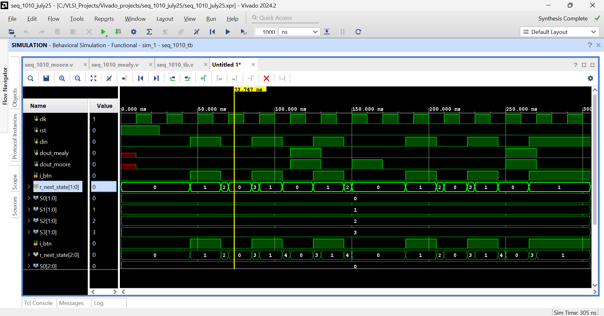
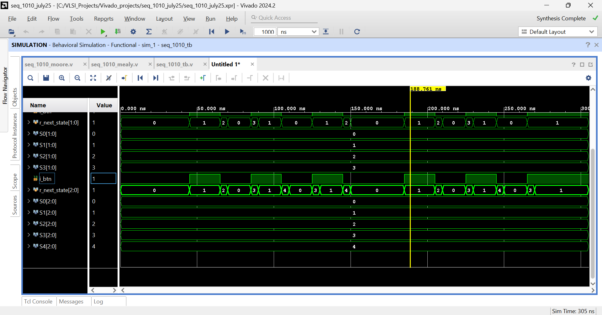
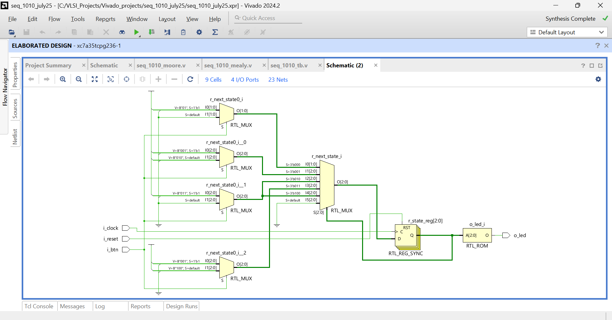

# 1010 Sequence Detector - Moore & Mealy FSM (Verilog)

Implements a sequence detector for the binary pattern **1010** using both Moore and Mealy FSM architectures in Verilog HDL. Synthesized and simulated on **Xilinx Vivado 2024.2** targeting the **Artix-7 (xc7a35tcpg236-1)** FPGA.

---

## Features
- Moore FSM: 5 states (S0–S4), output registered on state entry
- Mealy FSM: 4 states (S0–S3), output depends on current state + input
- Supports both **overlapping** and **non-overlapping** detection via parameter
- Common testbench for side-by-side comparison of both architectures

---

## FSM Architecture Comparison

| Property | Moore | Mealy |
|----------|-------|-------|
| States | 5 (S0–S4) | 4 (S0–S3) |
| Output depends on | State only | State + Input |
| Output registered | Yes | Yes (clocked) |
| Detection latency | 1 cycle later | Same cycle |

---

## Simulation Results

### Moore vs Mealy - Side by Side

- Both `dout_mealy` and `dout_moore` pulse HIGH on correct 1010 detection
- Moore FSM state transitions: 0->1->2->3->4->0
- Mealy FSM state transitions: 0->1->2->3->0

### State Transitions Detail

- Mealy `r_next_state[1:0]` cycles through 0->1->2->3
- Moore `r_next_state[2:0]` cycles through 0->1->2->3->4
- Both overlapping and non-overlapping modes verified 

---

## Synthesis Results - Xilinx Artix-7 (xc7a35tcpg236-1)

> Note: Synthesized on Moore FSM module (`seq_1010_moore`)

| Resource | Used | Available | Utilization |
|----------|------|-----------|-------------|
| Slice LUTs | 2 | 20,800 | <0.01% |
| Flip-Flops | 3 | 41,600 | <0.01% |
| I/O Ports | 4 | 106 | 3.77% |
| BUFGCTRL | 1 | 32 | 3.13% |
| Block RAM | 0 | 50 | 0.00% |
| DSPs | 0 | 90 | 0.00% |

### RTL Schematic

Key inferred primitives:
- `RTL_MUX` trees - next-state logic for all 5 states
- `RTL_REG_SYNC` - state register with synchronous reset (3 FDREs)
- `RTL_ROM` - output logic (state == S4 -> LED on)
- `BUFG` - global clock buffer

Full utilization report: [synth/utilization_report_seq.txt](synth/utilization_report_seq.txt)

---

## Project Structure
- src/

  seq_1010_moore.v      # Moore FSM implementation

  seq_1010_mealy.v      # Mealy FSM implementation

  seq_1010_tb.v # Common testbench

- simulation/# Waveform screenshots

- synth/# Schematic + utilization report

---

## Tools
- Xilinx Vivado 2024.2
- Target: xc7a35tcpg236-1 (Artix-7, Speed Grade -1)
- HDL: Verilog (IEEE 1364-2001)
